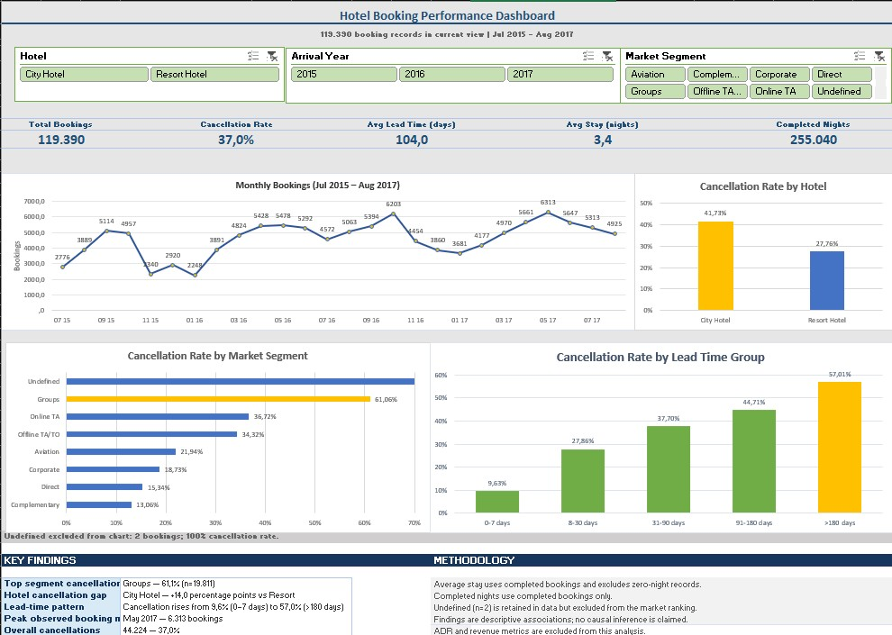

# Hotel Booking Demand Analysis

**Tools:** Microsoft Excel, Power Query, PivotTables, PivotCharts, Slicers  
**Dataset:** 119,390 booking records  
**Period:** July 2015 – August 2017  
**Focus:** Cancellation, booking trends, market segments, and lead time

## Project Overview

This project analyzes 119,390 hotel booking records from July 2015 to
August 2017 to explore booking volume, cancellation behavior, seasonality,
and customer booking patterns.

The analysis was developed entirely in Microsoft Excel using Power Query
for data preparation and PivotTables, PivotCharts, and slicers for analysis
and interactive reporting.

## Interactive Dashboard

Explore the interactive Looker Studio dashboard:

[View Interactive Dashboard](https://datastudio.google.com/reporting/599894d4-36d7-4c4a-9167-30d780122590)

## Project Files

- [Download Interactive Excel Workbook](workbook/Hotel_Booking_Portfolio.xlsx)
- [View Dashboard Image](assets/hotel-booking-dashboard.jpg)

## Business Questions

The analysis focuses on the following questions:

- What is the overall booking cancellation rate?
- How does cancellation behavior differ between City Hotel and Resort Hotel?
- Which market segments show higher cancellation rates?
- How does cancellation rate vary across lead-time groups?
- How does monthly booking volume change throughout the observation period?

## Dataset

- Total records: 119,390 booking records
- Observation period: July 2015 – August 2017
- Domain: Hotel bookings
- Unit of analysis: Booking record
- Source: [Hotel booking demand](https://www.kaggle.com/datasets/jessemostipak/hotel-booking-demand)

The dataset does not contain a unique customer identifier, so booking records should not be interpreted as unique customers.

## Tools & Skills

- Microsoft Excel
- Power Query
- Data Cleaning
- Data Quality Validation
- PivotTables
- PivotCharts
- Interactive Slicers
- KPI Development
- Exploratory Data Analysis
- Dashboard Design

## Data Preparation

The dataset was cleaned and transformed using Power Query.

Key preparation steps included:

- Auditing missing values and data-type errors
- Handling missing values in the `children` field
- Preserving raw data for traceability
- Creating `total_nights`
- Creating `total_guests`
- Creating `arrival_date` and `year_month`
- Creating `lead_time_group`
- Creating guest and booking quality flags
- Auditing zero-night and no-guest booking records
- Validating row counts after transformations

ADR was excluded from the final analysis scope to avoid using a field
whose interpretation and transformation were not sufficiently reliable
for this portfolio analysis.

## Dashboard

## Key Metrics

| Metric | Result |
|---|---:|
| Total Bookings | 119,390 |
| Cancellation Rate | 37.0% |
| Average Lead Time | 104.0 days |
| Average Stay | 3.4 nights |
| Completed Nights | 255,040 |

## Key Findings

### 1. Overall cancellation

44,224 of 119,390 booking records were cancelled, producing an overall
cancellation rate of approximately 37.0%.

### 2. Hotel cancellation difference

City Hotel recorded a cancellation rate of 41.73%, compared with 27.76%
for Resort Hotel — a difference of approximately 14 percentage points.

### 3. Lead-time pattern

Cancellation rates increased across longer lead-time groups:

- 0–7 days: 9.63%
- 8–30 days: 27.86%
- 31–90 days: 37.70%
- 91–180 days: 44.71%
- More than 180 days: 57.01%

### 4. Market segment

Among substantial market segments, Groups showed the highest cancellation
rate at 61.06% across 19,811 booking records.

### 5. Monthly booking volume

May 2017 recorded the highest observed monthly booking volume with
6,313 bookings.

## Recommendations

Based on the descriptive analysis:

- Monitor bookings with longer lead times more closely because these
  groups show substantially higher cancellation rates.
- Investigate the Groups market segment further to identify operational
  factors associated with its high cancellation rate.
- Consider separate cancellation monitoring for City Hotel and Resort
  Hotel because their cancellation profiles differ considerably.
- Use monthly booking patterns as one input for operational planning,
  while accounting for the partial-year coverage of 2015 and 2017.

## Limitations

- The analysis is descriptive and does not establish causality.
- Booking records do not represent unique customers.
- The dataset contains partial-year observations for 2015 and 2017.
- Some anomalous booking records, including zero-night and no-guest
  records, were retained and flagged rather than automatically removed.
- ADR and revenue analysis were excluded from the final project scope.
